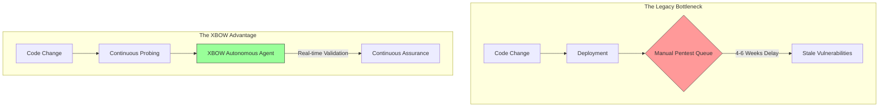

# XBOW

🏹 XBOW: The Enterprise "Wedge" Strategy

Subject: Strategic POV for the Enterprise AE Role

Prepared by: Carl Garcia

Thesis: Transitioning the Enterprise segment from "Human-Paced" Defense to "Machine-Speed" Continuous Assurance.
---
## 01. The 2026 Reality: Tempo is the New Baseline

Oege nailed the problem: We are in the [Chaos Phase.](https://xbow.com/blog/the-chaos-phase-ai-cybersecurity-threats-2025) The **GTG-1002** intrusion proved that attackers aren't necessarily getting smarter, but they’re just getting faster. While defenders are waiting for a manual pentest report to clear legal, the attacker has already iterated 100 times.

Reference: [Security in 2026: What Breaks, What Scales, and What Survives](https://xbow.com/blog/security-in-2026-what-breaks-what-scales-and-what-survives)

**The Mission:** We aren't selling a "better pentest." We are selling **Machine-Speed Tempo.**

### The "Manual Validation Bottleneck"

Threat Actors are moving at machine-speed while security teams are forced to play defense stuck with manual workflows and processes that force them to wait for pentests that take 4-6 weeks. 

## 02. The Enterprise "Wedges" (Where we actually win)
CISOs are tired of tools, they want outcomes. 

Here is how I plan to wedge XBOW into the Enterprise by targeting the "Manual Validation Bottleneck." 

Traditional Enterprise security is reactive. Security teams wait for a manual audit, while engineering teams ship code daily. This creates Security Debt that grows exponentially.

I see four primary "High-Gravity" wedges to land XBOW in the Enterprise Segment:

⚡ **Wedge A: Supply Chain Validation**
The Pain: Third-party vendor risk management (TPRM) is currently just a bunch of PDF questionnaires.

The XBOW Play: "Show me, don't tell me." Use XBOW to validate the external security claims of critical software vendors. Real-World recent example: log4j in 2022. Where am I impacted? What is the actual impact? 

💡 **Wedge: B: Increase Compliance Velocity**

The Pain: Enterprises are shifting from "Point-in-Time" to "Real-Time" trust.

The XBOW Play: XBOW’s integration with platforms like Vanta and Rhymetec proves that their primary wedge is unblocking the audit bottleneck for high-growth digital native & enterprise companies. Don't wait 6 weeks for a report to close your audit. XBOW gives you a compliance ready, expert level pentest report in 5 days for a fraction of the cost. If you fix a bug, you click 'Re-test' and it verifies the fix instantly.

🔄 **Wedge C: Unlock the CI/CD Bottleneck** 

The Pain: Modern engineering teams ship code daily or weekly. Traditional pentesting happens annually. This creates a massive "risk window" where new code is live but untested.

The XBOW Play: Integrate XBOW directly into your CI/CD pipeline. It doesn't just scan. It actively attacks every major pull request like a human hacker. It validates the bug and gives the developer the exact code fix before the vulnerability ever reaches production.

🛡️ **Wedge D: Proliferation of AI-generated/Assisted Code stay at Bay**

The Pain: Human security reviewers cannot keep up with the expotential increase in volume of AI-generated code being committed. In Q3 Earnings Call FY 2026 more than 40% of [Walmart's](https://finance.yahoo.com/news/target-eyes-fy26-turning-point-174500119.html) new software code is now either AI-generated or AI-assisted. 

The XBOW Play: XBOW is the only engine that reads the source code (Whitebox) and attacks the running app (Blackbox) simultaneously, catching the logic flaws that AI coding assistants introduce.

## 03. GTM Execution: 90 Day Deployment Schedule 

🗓️ **Phase 1: Days 1-30 Days** Intelligence/Knowledge Transfer Sprint

* **Account Segmentation:** Prioritize a 3-Tier approach based on ICP. Focus on Engineering-heavy orgs with mature SDLCs.
* **Chaos Phase Mapping:** Identify accounts currently encountering the Structural Mismatch (Human defense vs. Machine-speed offense).
* **Internal Alignment:** Shadow Eng/AppSec teams to internalize how XBOW agents bridge the Manual Validation Bottleneck.

🗓️ **Phase 2: Days 31-60 Days** Strategic Wedge Execution

* **The Outreach:** Launch targeted "Wedge Plays" (Supply Chain Validation, Compliance Velocity, CI/CD Bottlenecks, AI-Assisted code threatas)
* **Signal over Noise:** Focus on "Actionable Pipeline" targeting CISOs and AppSec leads who have explicitly felt the instability of AI-driven threats.
* **Proof of Value:** Conduct initial discovery focused on current snapshot security failures and the need for Continuous Assurance.

🗓️ **Phase 3: Days 61-90** Execution & Ownership

* Execute on developed pipeline towards Mutual Action Plan (MAP) to setup and frame successful PoC engagements -> convert to clear technical wins. 
* Continued PG (Pipe Gen) towards building 4x pipeline to revenue target
* Pipeline Progression: Move from initial land experiments to repeatable playbooks 

## **04. Why XBOW for Me**

* **CISO Alignment (The Cloudflare Foundation):** 6 years at Cloudflare partnering with security orgs to build defensive security postures. Understand/think about what keeps a CISO up at night. Recognize the shift and importance in OffSec (red team/blue team) to match the new rapid iteritive pace of the GenAI age. 
* **Technically Fluency**  I'm technically curious and follow the "eat own dog food" mantra to gain technical fluency with the customer: from Developer -> CX Suite to demonstrate value driven by tangible business outcomes.
* **Builder Mindset:** Passionate about building at the intersection of InfoSec + AI. Fueled by helping the team build the winning playbook to help contribute to the overall direction/impact of the **team**. 
  
## **05. Contact Me** 

https://www.linkedin.com/in/carlgarcia

